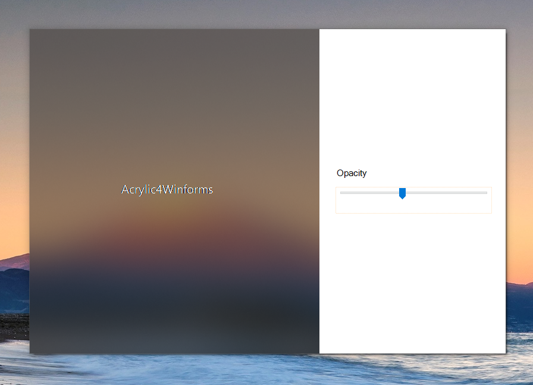

# Acrylic4VBWIn32
Example of how to implement fluent design's acrylic (meant for uwp) in win32 using VB.NET winforms.

  

 
You can move this form around by dragging the white area of the window, but <b>be warned, the form moves very s l o w l y.</b>
